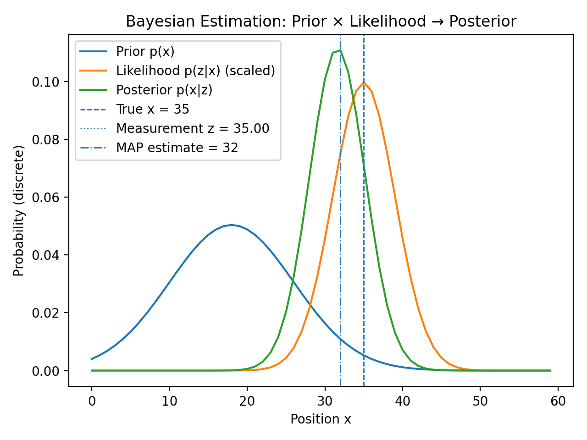

# Day 25: Bayesian Estimation (Intuition First)

> **Posterior ∝ Prior × Likelihood**  
> Estimation is not about knowing the truth, it’s about managing belief under uncertainty.

---

## Objective

Build **intuition** for Bayesian estimation using a minimal, transparent 1D example.

No Kalman equations.  
No matrix gymnastics.  
Just **belief → evidence → updated belief**.

This day focuses on *how* and *why* Bayesian reasoning works in robotics systems.

## Core Idea (Systems View)

In robotics, the true state is almost never known.

- Sensors are noisy.  
- Models are imperfect.  
- Time delays exist.  
- Uncertainty is permanent.  

Instead of asking:
> *“What is the state?”*

Bayesian estimation asks:
> *“What do I believe the state is, and how confident am I?”*

This belief is represented as a **probability distribution** over possible states.

## Experiment Setup

- **World**: $1D$ discrete grid of positions  
- **Hidden true state**: unknown to the estimator  
- **Measurement model**:  

  $$z = x + noise, noise ~ N(0, σ²)$$

### Distributions
- **Prior** `p(x)` — initial belief (biased and uncertain)  
- **Likelihood** `p(z | x)` — probability of observing measurement `z` if the system were at `x`  
- **Posterior** `p(x | z)` — updated belief after incorporating the measurement  

## Bayesian Update

The update rule:

$$p(x | z) ∝ p(z | x) · p(x)$$

In code:

```python
posterior = normalize(prior * likelihood)
```

This single line is the foundation of:
- Kalman Filters.  
- EKFs.  
- Particle Filters.  
- Sensor fusion systems  

## Results & Interpretation



Key observations:
- Posterior shifts toward the measurement but does not ignore the prior.  
- Posterior is narrower → reduced uncertainty.  
- MAP estimate lies between prior mean and measurement.  

This reflects a **confidence-weighted compromise**, not blind trust.

## Repository Structure

```
day25_bayesian_estimation/
├── README.md
├── bayesian_estimation.py
└── results/
    ├── bayes_update_plot.png
    └── bayes_update_data.csv
```

## Takeaway

- Control decides **what to do**.
- Estimation decides **what you think is happening**.

If estimation is wrong, control is hallucinating.

Bayesian thinking turns uncertainty into a **design variable**.

## What’s Next

**Day 26: Kalman Filter (Scalar)**  
This intuition collapses into a recursive estimator suitable for real-time systems.

**Consistency > intensity.**  
**Belief > certainty.**  
**Systems > tricks.**

---