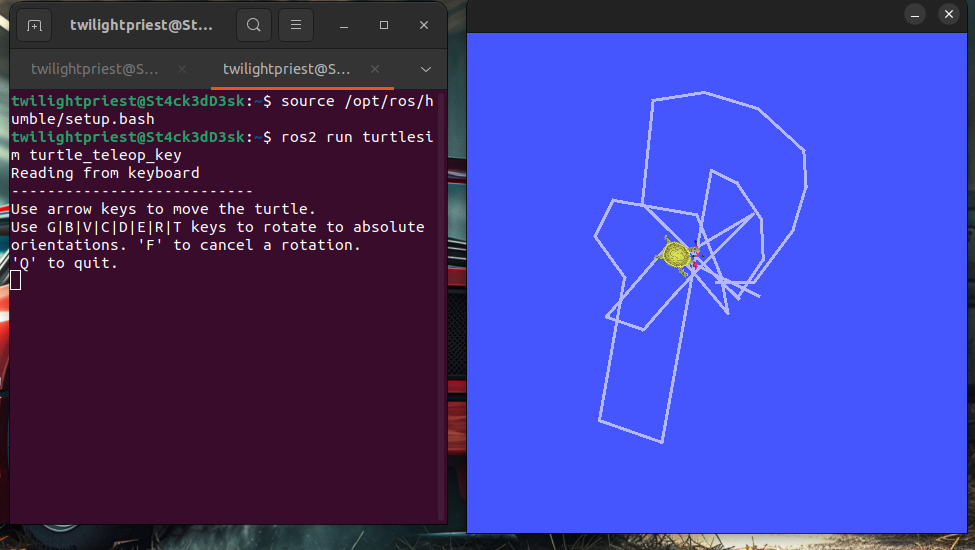

# Day 31: Perception as a System (ROS2 Environment Bring-up)

## What I did today

Today marked the transition into the **Perception** phase of the curriculum.
Instead of jumping into computer vision pipelines, the focus was on setting up
and validating a **real ROS2 environment**, ensuring the platform itself is
stable before layering perception systems on top.

---

Concrete actions performed:

- Installed and validated **Ubuntu 22.04 LTS**.
- Installed **ROS2 Humble (Desktop)**.
- Installed and verified ROS build and dependency tooling:
  - `colcon`
  - `rosdep`
- Ran a ROS2 smoke test using `turtlesim` to confirm runtime correctness.
- Initialized a ROS2 workspace and verified the build pipeline.

This establishes a known-good baseline for all future perception work.

## Why this counts as “Perception”

Perception is not computer vision magic. It is a **measurement system** that converts the physical world into **delayed, noisy, rate-limited signals** that downstream systems must reason with.

Perception systems only work if:

- the OS is stable.
- the middleware is configured correctly.
- the runtime is predictable.
- the build and dependency pipeline is reliable.

Today’s work ensures those assumptions are valid.

## Systems View of Perception

Perception ≠ truth.

Perception is a pipeline:

Physical world  
→ Sensors.  
→ Signals + noise.  
→ Measurement models.  
→ State estimates (with uncertainty + delay).

Control and planning never see reality, they see **beliefs**. Ignoring this is one of the main reasons real robots fail.

## Commands Executed

### ROS environment setup (new terminal):

```bash
source /opt/ros/humble/setup.bash
```

### ROS smoke test:

```bash
ros2 run turtlesim turtlesim_node
```

In a second terminal:

```bash
ros2 run turtlesim turtle_teleop_key
```

## Smoke Test Result

Below is the ROS2 runtime smoke test using `turtlesim`, confirming that:
- ROS2 nodes are running correctly.
- Keyboard input is published and received.
- The middleware → node → visualization loop is closed.



### ROS2 workspace initialization

```bash
mkdir -p ~/ros2_ws/src
cd ~/ros2_ws
colcon build
```

Build result:

```
Summary: 0 packages finished
```

This confirms:

- `colcon` is functioning.
- CMake toolchain is valid.
- ROS environment is sourced correctly.
- Workspace is ready for future packages.

## Evidence

- Successful `turtlesim` runtime execution.
- Clean `colcon build` on an empty workspace.
- Screenshot saved under `results/`.

## Key Takeaway

Perception work starts **before sensors**. If the platform is unstable, no perception stack will save the system.

---